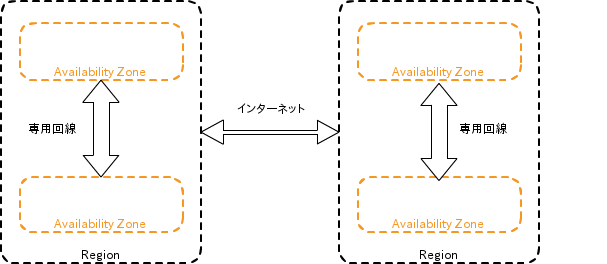
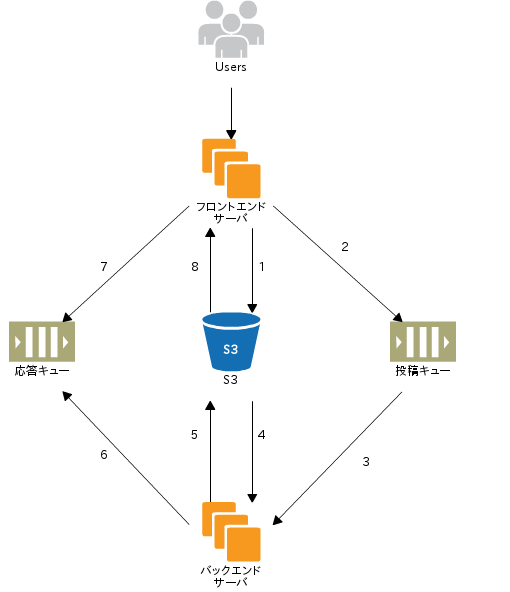
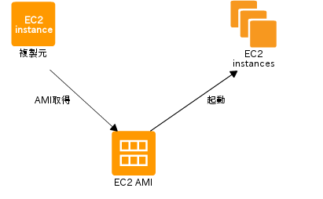
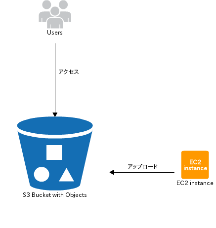
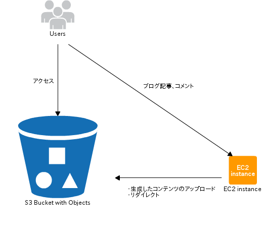
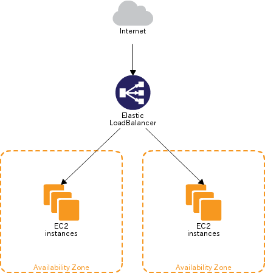
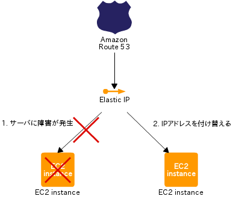

# Amazon Web Service 勉強会 #

Amazon Web Service (以下 AWS) とは、Amazon がウェブサービスという形で提供するクラウドコンピューティングサービスです。2006 年にサービス提供を開始してから現在に至るまで、様々なコンポーネント・サービスが追加され、現在 (2013/03/11 時点) は 34 個のコンポーネント・サービスが提供されています。また、今もなお日々進化しています。

## リージョン、AZ ##

AWS の重要な仕組みとして、リージョンと Available Zone (AZ) があります。AZ とは、要は現実世界に存在する AWS のデータセンターのことで、リージョンとはそれが存在する地域のことです。現時点 (2013/03/11 時点) で世界9ヶ所のリージョンがあります。1つのリージョン内にはデータセンターが複数拠点存在します。
AZ はお互いに地理的、電源的、ネットワーク的に分離されています。複数の AZ に分散してコンポーネントを配置することで、災害が発生してもサービスを停止させることなく運用し続けることができます。AZ 間は専用回線でつながれているので、データの転送も高速です。
リージョンが異なれば物理的により離れた土地となるので、自然災害などによるサービス停止のリスクをより一層抑えることができます。ただしリージョン間のデータ転送はインターネットを経由しますので、AZ 間に比べれば遅くなります。

## 課金方式 ##

AWS は基本的に有料のサービスです。AWS は徹底した従量制の課金体系をとっています。使いたい量、使いたい性能、使いたいサービスを指定してインフラを借りることができ、それを使った分だけ料金が発生します。
この料金体系により、1時間単位で仮想サーバを確保したり、任意の時間帯だけマシンスペックの高い仮想マシンを借りたりといった運用が可能となっています。

<table>
  <caption>例: 東京リージョンの EC2 料金表</caption>
  <tr> <th></th><th>Linux/UNIX 料金</th><th>Windows 料金</th> </tr>
  <tr> <th colspan="3">スタンダード オンデマンドインスタンス</th> </tr>
  <tr> <td>スモール（デフォルト）</td><td>$0.088 1 時間あたり</td><td>$0.115 1 時間あたり</td> </tr>
  <tr> <td>中程度</td><td>$0.175 1 時間あたり</td><td>$0.230 1 時間あたり</td> </tr>
  <tr> <td>ラージ</td><td>$0.350 1 時間あたり</td><td>$0.460 1 時間あたり</td> </tr>
  <tr> <td>エクストララージ</td><td>$0.700 1 時間あたり</td><td>$0.920 1 時間あたり</td> </tr>
  <tr> <th colspan="3">第 2 世代スタンダードオンデマンドインスタンス</th> </tr>
  <tr> <td>エクストララージ</td><td>$0.760 1 時間あたり</td><td>$0.980 1 時間あたり</td> </tr>
  <tr> <td>ダブルエクストララージ</td><td>$1.520 1 時間あたり</td><td>$1.960 1 時間あたり</td> </tr>
  <tr> <th colspan="3">マイクロ オンデマンドインスタンス</th> </tr>
  <tr> <td>マイクロ</td><td>$0.027 1 時間あたり</td><td>$0.035 1 時間あたり</td> </tr>
  <tr> <th colspan="3">ハイメモリオンデマンドインスタンス</th> </tr>
  <tr> <td>エクストララージ</td><td>$0.505 1 時間あたり</td><td>$0.570 1 時間あたり</td> </tr>
  <tr> <td>ダブルエクストララージ</td><td>$1.010 1 時間あたり</td><td>$1.140 1 時間あたり</td> </tr>
  <tr> <td>クワドラプルエクストララージ</td><td>$2.020 1 時間あたり</td><td>$2.280 1 時間あたり</td> </tr>
  <tr> <th colspan="3">ハイ CPU オンデマンドインスタンス</th> </tr>
  <tr> <td>中程度</td><td>$0.185 1 時間あたり</td><td>$0.285 1 時間あたり</td> </tr>
  <tr> <td>エクストララージ</td><td>$0.740 1 時間あたり</td><td>$1.140 1 時間あたり</td> </tr>
</table>

## 利点と欠点 ##

AWS を導入することにより、様々なメリットを得ることができます。同時に、いくつかのデメリットも生じます。以下にメリットとデメリットをそれぞれ列挙しました。

### メリット ###

1. 動的なインフラである
2. 初期コストを低く抑えることができる
3. 高スペックの環境を時間単位で利用できる
4. 各種サービスに API が用意されている
5. ハードウェアの物理障害をケアする必要がない

### デメリット ###

1. AWS がサービスダウンした際に、自社で解決できない
2. 事前にコストが決まらない
3. 会員情報などを AWS に預けるリスク
4. 1つ1つのインスタンスが弱い
5. グローバルIPアドレスの使い回し

## 導入事例 ##

AWS は様々な企業、機関で採用されています。AWS を直接利用したことはなくても、AWS 上に展開されたサービスを利用したことはあるのではないでしょうか。

[http://aws.amazon.com/jp/solutions/case-studies-jp/](http://aws.amazon.com/jp/solutions/case-studies-jp/)

* 株式会社東京証券取引所

東京証券取引所では、運用機能やサービス監視機能を実施するためのパッケージの検証環境としてAmazon EC2とAmazon VPCを利用し、サーバー購入と5年間の保守費用も加味した場合に100万円以上になる費用を、最終検証も踏まえ数万円に抑えることができました。

* 九州大学

九州大学は「クラウド型教育要計算機システム」のハイブリッド型クラウド環境の構築にAmazon EC2、S3,VPCを採用。大幅なコスト削減に加え、学府内のIPアドレス体系を利用でき、学府内に設定されているサーバ等との連携を容易に実現しています。

* クックパッド株式会社

クックパッド株式会社は、平常時とピーク時とのトラフィックの差、素早いサービスのリリースに対してインフラ調達を行うため、AWSを採用。Amazon VPC環境でAmazon EC2、S3を中心に活用することにより、柔軟で堅牢なシステムセキュリティを実現しています 。

* トーカ堂テレビショッピング

トーカ堂 テレビショッピングは、Amazon EC2をオンラインショップ運営に活用することで、アクセス集中にも耐えられるインフラ環境を実現すると共に大幅なコスト削減を実現できました。

* 株式会社マピオン

マピオンが提供する「ケータイ国盗り合戦」は、急激なアクセスの変化に対応し、安定したサービス提供を続けるためにAWSのフレキシブルなリソースで運用されています。

## コンポーネントの紹介 ##

ここでは、AWS で提供されているコンポーネントを紹介します。すべてのコンポーネントを紹介することは紙面と時間の都合上できないので、いくつかの主要なコンポーネントに絞って紹介したいと思います。

### EC2 ###

最初に紹介するのは Amazon Elastic Compute Cloud (EC2) です。AWS の中でももっともポピュラーで、かつ汎用的なコンポーネントでしょう。
このコンポーネントは、要は仮想マシンです。好きな OS をインストールし、その上で任意のサービスを展開することができます。アプリケーションサーバとしての利用が一般的で、LAMP 構成 (死語?) でサービスを展開したり、DB 専用のマシンにしたり、はたまた何かの計算専用に利用したりと、用途は様々です。

#### EC2 の魅力 ####

EC2 の魅力は、なんと言ってもその柔軟性です。サーバを増やしたり減らしたり、サーバのスペックを上げたり下げたり、ちょっとした手続きを踏むだけでカンタンに調整することができます。
また、Amazon マシンイメージ (AMI) という仕組みにより、複製を作ることも容易です。この AMI を利用することで、非常に柔軟なクラウドらしいサーバ運用が可能です。詳しくは後述します。

#### 使ってみる ####

それでは、EC2 を実際に使ってみたいと思います。今回は EC2 インスタンスの追加から起動、その上で Apache HTTP Server を起動して端末から接続、最後に EC2 インスタンスの停止までを行なってみたいと思います。

1. Amazon EC2 管理コンソールを開く

    [https://console.aws.amazon.com/ec2/](https://console.aws.amazon.com/ec2/) にアクセスし、メールアドレス、パスワードを入力する。

2. ナビゲーションバーからリージョンを選択する

    画面上部のナビゲーションバーから、EC2 インスタンスを配置するリージョンを選択します。今回は Tokyo リージョンを選びます。

3. Amazon EC2 コンソールの Launch Instance をクリック

    インスタンスの新規作成画面に遷移します。
    インスタンスの起動方法を選択することができます。今回は Quick Launch Wizard を選択します。いろんな設定を自動的に行なってくれるので、手っ取り早く始まるにはうってつけです。

4. インスタンスに名前をつける

    名前は適当につけます。

5. SSH でログインするために必要な鍵のペアを作成

    ここでは鍵ペアの名前をつけます。鍵ペアは複数の EC2 インスタンスで共有することができます。

6. AMI として Amazon Linux AMI 2012.09.1 を選択

7. Continue をクリック

    作成した EC2 インスタンスの詳細画面が表示されます。

8. 内容を確認し、Launch をクリック

    この時点で 5 で作成した鍵ペアの秘密鍵がダウンロードされています。後ほど行う ssh 接続にて使用します。

9. EC2 コンソールの Instances から 4 でつけた名前のインスタンスを選択

    画面下部に EC2 インスタンスに接続するためのドメイン名が表示されています。このドメイン名と事前にダウンロードした秘密鍵を用いて EC2 インスタンスに ssh で接続します。

10. ssh で EC2 インスタンスにログイン

    ユーザ名は ec2-user とします。

        ssh -i 秘密鍵 ec2-user@ドメイン名

11. Apache HTTP Server をインストール、実行

    EC2 インスタンス上で、以下のコマンドを入力します。

        sudo yum -y install httpd
        sudo vi /var/www/html/index.html  # hello! と入力
        sudo /sbin/service httpd start

    httpd が起動したことを確認し、ブラウザから接続すると "hello!" と表示されそうですが、残念ながらまだ接続できません。ポートがあいていないためです。

12. EC2 コンソールの Security Groups からポートの設定を変える

    EC2 インスタンスが利用している Security Group を確認し、その設定を変更します。 HTTP を選択して Add Rule し、Apply Rule Changes します。これで HTTP (80番) のポートが開いたことになります。

13. ブラウザから接続

    最後に、ブラウザから EC2 インスタンスへ接続します。"hello!" と表示されれば成功です。

#### AWS のアカウント登録 ####

AWS のアカウントを登録するには、

1. クレジットカード番号
2. 電話番号

が必要です。
クレジットカード番号は、言わずもがな、AWS の使用料を払うために必要です。無料期間内であっても必要となります。
電話番号は本人確認のために必要です。入力フォームに電話番号を入力して確定すると、Amazon から電話がかかってきます。電話の音声案内に従って、画面に表示されている暗証願望を入力すると、本人確認が完了し、アカウント登録の次のステップへ進めるという寸法です。

### EBS ###

EC2 で注意すべき点は、データの永続化ができないという点です。AMI に含まれていないデータは、インスタンスの停止時に全て失われてしまいます。
EC2 で提供されている Elastic Block Storage (EBS) は、EC2 インスタンスからマウント可能な永続可能なストレージです。EC2 上で永続したいデータがある場合には EC2 とは別途 EBS ボリュームを確保する必要があります。
EC2 にマウントされた EBS ボリュームは、OS からはローカルなデバイスとして認識されます。

#### スナップショット ####

EBS にはそのスナップショットを保存する機能があります。スナップショットは後述するストレージサービス Amazon Simple Storage Service (S3) 上に保存されます。また、スナップショットは差分で保存されるので、容量も抑えられるようになっています。

### SQS, SNS ###

Amazon Simple Queue Service (SQS) はコンピュータ間でやり取りするメッセージを格納するキューサービスです。作成できるキューの数に制限はなく、メッセージ数も無制限です。料金はリクエストごとにかかる少額の手数料 (0.0000005 米ドル/リクエスト) とデータ転送にかかる料金だけで、コストを低く抑えることができます。

Amazon Simple Notification Service (SNS) はクラウドからのメッセージ通知を提供するサービスです。通知先は HTTP/HTTPS, Email/Email-JSON, Amazon SMS, SQS から選ぶことができます。SQS は単独で使うとメッセージをポーリングする必要があります。SNS と組み合わせることでプッシュ型通知を実現できるので、無駄なポーリングが不要となります。タイミングが重要なメッセージングにおいては、SQS と SNS を組み合わせて使うべきでしょう。

#### SQS のユースケース ####

動画トランスコーディング Web サイトでの利用を考えてみます。EC2、SQS、S3 を利用します。

1. エンドユーザーがアップロードしたトランスコーディング対象の動画を S3 に格納する
2. S3 に格納した動画へのポインタとともに、投稿キューにメッセージを追加
3. バックエンドサーバは投稿キューからメッセージを受信し、動画のトランスコーディングのお仕事がまわってきたことを知る
4. バックエンドサーバはメッセージに書かれたポインタを元に、S3 からトランスコーディング対象の動画を取得する
5. バックエンドサーバは動画のトランスコーディングを行い、その結果として生成したトランスコーディング後の動画を S3 に格納する
6. S3 に格納したトランスコーディング後の動画へのポインタとともに、応答キューにメッセージを追加
7. フロントエンドサーバは応答キューからメッセージを受信し、動画のトランスコーディングが終わったことを知る
8. フロントエンドサーバはメッセージに書かれたポインタを元に、S3 からトランスコーディング後の動画を取得し、ユーザに提供する

SQS を使うことで、フロントエンドサーバとバックエンドサーバを疎結合にできていることが見て取れるかと思います。疎結合としたことでボトルネックとなっている箇所にだけリソースをつぎ込む (トランスコーディングが間に合っていなければ、バックエンドサーバの EC2 インスタンスを増やす、性能を上げるなど) といったことが可能になります。このような疎結合を推進するインフラとなるのが SQS です。

### S3 ###

Amazon Simple Storage Service (S3) は AWS 上で展開されるストレージサービスです。シンプルなAPI、高い堅牢性と可用性が特徴です。公式の情報によれば、「指定された 1 年にわたり、99.999999999% の堅牢性と、99.99% の可用性を提供するよう設計」されているそうです。
データは「オブジェクト」として保管され、「バケット」という単位にまとめられます。「バケット」の格納先には任意のリージョンを選択できます。あるリージョンに配置されたバケットは、ユーザが明示的に移動させない限り、そのリージョンから移動することはありません。
EBS がボリュームサイズに対して料金が発生するのに対し、S3 ではデータの取得にときにだけ料金が発生します。データの格納には料金が発生しません。

また、S3 では静的な Web サイトのホスティングができます。S3 のバケットを Web サイトとして設定できます。S3 を使うことで Web サーバーをセットアップしたり、監視したり、スケールしたりといった管理の手間が不要となります。

#### Reduced Redundancy Storage (RRS) ####

RRS (低冗長化ストレージ) は S3 のストレージオプションの 1 つです。素の S3 に比べて堅牢性が落ちる代わりに、料金も低く抑えられています。さほど重要でない、再生可能なデータを保存するのに向いています。画像変換により出力されたサムネイルや、トランスコードした動画データ、その他カンタンに再生可能なデータを S3 に比べて低いコストで保存しておくことができます。
公式の情報によれば、「付与された1年に対して、99.99％の堅牢性と、99.99％の可用性を提供するよう設計」されているそうです。

#### Amazon Glacier ####

Amazon Glacier は S3 のストレージオプションの 1 つです。Glacier は 1 ヶ月あたり 0.01 米ドル/GB という料金となっており、S3 や RRS と比べて低いコストでデータを保管できます。ただしデータの取り出しには時間がかかる (3 〜 5 時間) ので、アクセス頻度の低いデータを保管するのに向いています。長期に渡るデータのバックアップ、過去のログデータ、その他大量データのアーカイブといった用途が考えられるのではないでしょうか。
公式の情報によれば、「指定された 1 年にわたり、99.999999999% の堅牢性と、99.99% の可用性を提供するよう設計」されているそうです。

#### 使ってみる ####

S3 を使って静的 Web サイトのホスティングをやってみます。

1. バケットを作成する

    バケット名と、バケットを配置するリージョンを選択します。入力を終えたら Create をクリックします。
    バケット名はユーザーごとの名前空間を持たないので、重複しない名前をつける必要があります。

2. バケットにファイルをアップロードする

    適当なテキストを入力したファイルをバケットにアップします。

3. ファイルのパーミッションを変更する

    ブラウザからアクセスできるように、パーミッションを変更します。

4. 静的ウェブサイトのホスティングを有効にする

    All Buckets の Properties より、Static Website Hosting を開きます。ここから Enable website hosting を選択し、Index Document に先ほどアップしたファイル名を入力します。

5. ブラウザから Endpoint にアクセスする

    最後に Static Website Hosting のところに表示されているバケットの Endpoint にブラウザからアクセスします。2 で入力したファイルの内容が表示されれば成功です。

### RDS ###

Amazon Relational Database Service (RDS) は、クラウド上でリレーショナルデータベースをカンタンにセットアップ、運用、拡張することのできるウェブサービスです。
RDS では既存の MySQL, Oracle, SQLServer の機能を引き続き利用することができます。DB に対するツール、アプリケーションコードをほとんどそのまま流用することも可能です。もちろんデータの引継ぎもできます。

RDS を利用することで、データベースソフトウェアの更新やデータバックアップの自動化、ストレージ容量をあとから容易に拡張するといったことが可能になります。

### Mechanical Turk ####

Amazon Mechanical Turk (Mechanical Turk) はこれまでに紹介したサービスとは毛色の異なるサービスです。これまで紹介してきたサービスは、クラウド上のコンピュータリソースを提供するサービスでした。Mechanical Turk は人材リソースを提供するクラウドサービスです。
コンピューティング技術が発展した今日にも、コンピュータが解くより人間が解いたほうがはるかに効果的なことは存在します。例えば、写真や動画のオブジェクトの識別、不適切なコンテンツのチェック、ユーザテストなどです。このようなタスクは一時的に大量の労働力を雇用するか、放置するしかなかったでしょう。

Mechanical Turk を利用すれば、API を通じて世界中にいるオンデマンドの労働者にアクセスでき、その仕事をプログラム的にビジネスプロセスに組み込むことが可能です。まさにクラウド時代の人海戦術と呼べるでしょう。

## AWS を活用した設計: クラウドデザインパターン ##

クラウドを利用したアーキテクチャの設計と運用といったノウハウがユーザの間で培われ、そのノウハウをうまく伝達する方法としてまとめたものが、AWS クラウドデザインパターンです。ここでは AWS の各種サービスの応用例として、いくつかのクラウドデザインパターンを紹介します。

### Stamp パターン (サーバの複製) ###

仮想サーバーに必要な OS やアプリケーションの設定は、非クラウドの物理サーバと同様の手間・時間・コストがかかります。負荷分散のためにサーバに増やしたいとしたとき、こういった手間がかかるのは面倒です。もちろん、初期設定を行うためのスクリプトを組むことでこの手間を省くこともできますが、ここではより手軽な方法を紹介します。

EC2 が提供する AMI という仕組みを使います。

1. 複製元の EC2 から AMI を作成
2. 複製先の EC2 インスタンスを作成
3. 複製先 EC2 インスタンスの AMI として、1 で作成した AMI を選択
4. 複製先 EC2 インスタンスを起動

この手法はなかなか有用で、次のようなシーンで使うこともできます:

* 負荷分散のためにサーバ増設
* リリース前における動作確認の環境構築
* 障害発生時のためのバックアップ

### Direct Hosting パターン (インターネットストレージで直接ホスティング) ###

短期間で急激にアクセス数が増加した場合、マシンの増設ではまにあわいません。これに対応するにはアクセス数を見越して、あらかじめサーバ数を増やしておくといった方法が考えられます。しかしその見通しがはずれると、コスト面に問題が出てきます。

このパターンでは、S3 を Web サーバとして利用し、画像や動画といった大容量の静的ファイルだけでなく、HTML ファイルなどもホスティングします。S3 なのでキャパシティーの面も問題ありませんし、もともとが独立したインターネットストレージサービスですので、急激なアクセス増にも耐えてくれます (ピーク時には 800,000 リクエスト/s を捌いてくれるとか)。

動的なサイトであっても、Movable Type のような静的コンテンツ生成型のアプリケーションであれば、このパターンを適用することが可能です。

コンテンツの配信は S3 から行います。ブログ記事やコメントの投稿は EC2 (で動く Movable Type) が処理します。EC2 はユーザが入力した内容をもとに静的コンテンツを生成し、S3 へアップします。最後にリダイレクト先として S3 の URL を指定します。

### Multi-Datacenter パターン (データセンターレベルの冗長化) ###

サーバ障害を想定したときの可用性向上には、サーバの数を増やして冗長化を図る方法が適しています。しかしデータセンターレベル (停電、地震、ネットワーク障害など) の障害を想定すると、単純にサーバの数を増やすだけでは対処できません。
こういった障害に対応するならば、当然複数のデータセンターにまたがった冗長化を図る必要がありますが、距離が十分に離れたデータセンターを複数確保し、さらにシステムの冗長化を図るためのハードウェアの調達、購入、セッティングなどなど、非常にコストがかかります。データセンター間の通信速度がネックになることも考えられるでしょう。

AWS は、ひとつのリージョン (地域) の中に、AZ という複数のデータセンターが存在します。利用するリージョン、AZ は選択可能で、EC2 インスタンスをどの AZ に配置するかは、ユーザが自由に決めることができます。さらに AZ 間は専用の高速回線で結ばれているので、AZ をまたいだシステムを構築できます。

### Floating IP パターン (IP アドレスの動的な移動) ###

サーバにパッチを当てたり、サーバをアップグレードする場合、サーバの停止が必要になります。また、障害発生時に予備のサーバに切り替えるといった運用でも、その切り替えにはある程度の時間を要します。当然ですが、システム提供者としてはこのような時間を最小限に抑えたいことでしょう。DNS の機能を利用することでサーバを切り替えることも可能ですが、TTL (Time to Live) 値より切り替え時間を短くできないので、即座に切り替えを行うには不向きです。

AWS では固定 IP アドレスを利用するサービスとして Elastic IP Address (EIP) を提供しています。これを利用することで、自身が持つ EC2 インスタンスに対して IP アドレスを自由に付け替えることができます。

Stamp パターンと併用することで、安全にアプリケーションのデプロイを実現することができます。
手元の環境で徹底的に動作確認して、いざ本番環境にデプロイしてもそこで問題が発生し、その瞬間から障害対応に入らなければなりません。それを回避すべく本番環境と同一構成のサーバをもう一台確保するにも、ハードウェアの購入、本番環境との同期といったメンテナンスなど、なかなかコストがかかります。ついでに、そこでうまくいったとしても、本番環境へのデプロイでミスをしてしまっては意味がありません。こういったことが積み重なると、精神衛生上よくありません。

そこで AWS の出番です。Stamp パターンと Floating IP パターンを併用し、次のような手順を踏むことで、安全安心にデプロイすることが可能です:

1. 本番環境の AMI を取得
2. 動作確認環境として、1 の AMI から EC2 を起動
3. 2 の環境で動作確認
4. 十分な動作確認ができたら、EIP を本番環境から動作確認環境へ付け替える

動作確認環境だったサーバを、EIP の付け替えによってそっくりそのまま本番環境とするわけです。デプロイのオペミスの心配はありません。また、その後未知のバグが発生したとしても、元の環境へ EIP を付け替えればいいという安心感もあります。デプロイ後の環境が安定すれば、元の環境は必要なくなるので破棄してもいいでしょう。そうすればサーバ維持のためのコストもかかりません。
